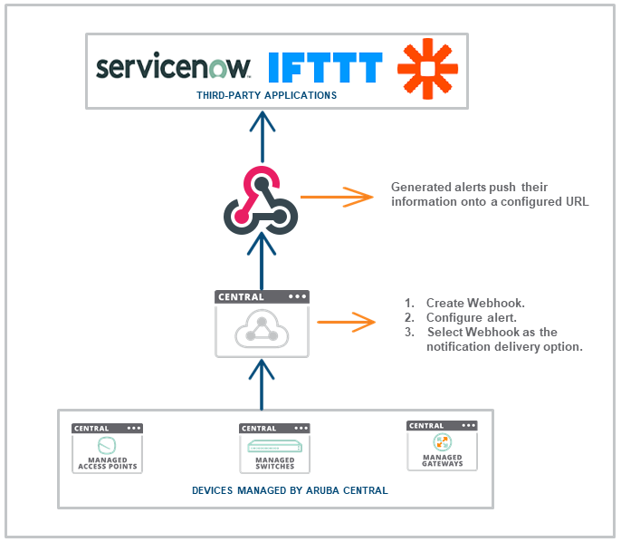
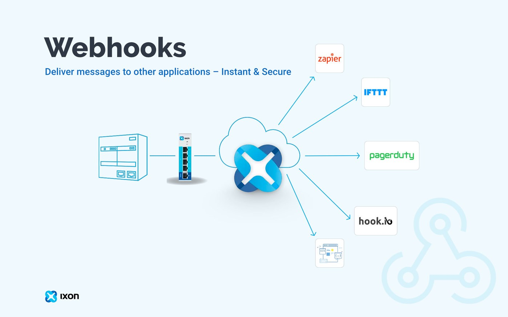

# RouterHook通知回调插件

路由器端的WebHook插件，方便路由器将消息通知回调到你配置的URL。

[反馈地址](https://koolshare.cn/thread-178114-1-1.html)

[更新日志](https://raw.githubusercontent.com/sdlyfjx/rogsoft/master/routerhook/Changelog.txt)

[QQ群:959376811](https://jq.qq.com/?_wv=1027&k=58nto0i)


> 感谢[ServerChan插件](https://koolshare.cn/forum.php?mod=viewthread&tid=123937&highlight=serverchan)作者，本插件基本都是在ServerChan插件基础上进行修改的。ServerChan是为程序员和服务器之间通信的插件，那么本插件可以说就是为路由器和服务器之间通信的插件。至于服务器上的逻辑，需要你自己实现，比如可以通过钉钉机器人、企业微信机器人、ServerChan、HomeAssistant等等实现更丰富的自定义消息处理逻辑。

## 缘起

身为一个资(zhuang)深(bi)程序员，ServerChan显然是满足不了我的要求的。因为ServerChan只是提供了一个通知推送的工具，但是如果我想用企业微信机器人呢？ServerChan显然满足不了要求哇。其实ServerChan还有一款可以进行【1对多】推送的`PushBear`和具有【双向交互】功能的`TalkAdmin`产品，都灰常好用！但毕竟这样支持的平台削微单一，不是那么有普适性，单独为他们开发插件远远超出了我的能力范围。为了方便同行们可以用自己熟悉的语言和环境，与路由器之间可以更进一步的交流（资深程序员不一定有空开发路由器插件不是），这个插件就诞生啦！不过说白了这个插件还是只是一个单向推送，没有实现被回调（貌似固件有WebAPI？没研究过，那个也超出了我的能力范围，暂时不管了）

- 这是我滴第一个作品，第一次接触shell和插件开发，所以基本就是些小修小改，踩了很多坑，也没有进行完善的测试，所以如果使用中有什么问题请即时反馈。
- 由于原ServerChan插件停更了，考虑到企业微信机器人也是用MarkDown消息的，可以考虑后续在ServerChan插件上增加企业微信甚至钉钉机器人的支持（如果你是个程序猿，有了本插件，剩下的你直接自己实现得了）

## 插件说明

_在网上找了些图解实WebHook的，大体一个意思吧，并不是对此插件的详细解释，但是技术上是相类似的。_**简单的说**就是和ServerChan一样配置了类似的功能开关后，路由器就会在定时、设备上线、重拨等事件发生时，自动将你需要的内容组织成JSON格式的数据POST到你配置好的回调**URL们**中。

**例如：** 下面这个图，webhook图标下方可以理解为路由器的内部处理逻辑，下方出现事件触发后，通过本插件将数据消息推送到最上面的那些云端或本地服务中。这里的云端服务可以是你自己的服务器搭建的Web服务、可以是利用现在时下流行的无服务器计算搭建的云函数（例如腾讯云的SCF啦、百度云的函数计算啦、或者LeanCloud啦）


**再如：** 下面这个图，正好有个路由器（这么巧），然后那个IXON云理解为本插件就好了，嗯嗯。


> 也就是说，这个插件只是负责把通知消息发送到你自己的服务上，<font color=red>而服务的逻辑需要自己去实现哦！</font>所以对于小白来说可能不太适用（因为这个是需要开发后台服务的）那有个卵用呢？具体例子见下方说明。

## Breaking Change 1.0

1.0版重大更新于2020/04/17发布。主要是增加了HomeAssistant的传感器功能和自定义请求头功能

## 使用方法

1. 软件中心安装
1. 配置回调URL（这里没做验证、任何校验和任何处理，你填写的URL将被原封不动的请求，也就是说`http://`或者`https://`这种不能省略，后面的路径和参数你也可以直接填写）
1. 配置好下方的消息内容开关
1. 通过点击`手动推送`按钮可以进行手动消息推送
1. 如果没啥bug的前提下，你配置的URL列表们就会依次收到路由器的消息回调了，具体的消息格式见下方
1. 服务器端收到的POST消息中`body`就是JSON序列化后的字符串，你需要进行反序列化哦（例如`JSON.parse(body)`)
1. 回调URL已支持环境变量功能，即系统会在请求URL前自动将URL中的所有`_PRM_EVENT`字符串替换为当前消息对应的`msgTYPE内容`（如你填写的URL为`https://www.baidu.com/_PRM_EVENT/search?type=_PRM_EVENT&info=aabbcc`则当系统中触发了`ifUP`事件时，回调的URL会变为`https://www.baidu.com/ifUP/search?type=ifUP&info=aabbcc`）
1. 目前触发类事件（网络重拨或客户端上线）已适配IFTTT官方的WebHook接口
1. 1.0版新增了三个动态参数和自定义Header功能，具体可见下方说明
1. 1.0版新增了虚拟传感器功能，将路由器的部分参数作为传感器接入HASS中，从而可以更完美的配合智能家居使用

## 应用举例

#### 接入HASS实现智能家居联动
1.0版本加入了HASS对接功能，只需要按照HASS官方的HTTP SENSOR说明配置好回调地址，配置好鉴权的Header，就可以实现路由器状态或客户端状态更新到HASS中。比如说：路由器CPU温度过高后HASS中场景控制散热器散热、白名单设备上线后控制回家场景等等

#### 通过IFTTT实现丰富功能
由于触发类事件以支持IFTTT的WEBHOOK功能，所以只需按照上述内容配置好你的IFTTT回调地址，即可在事件发生时触发IFTTT中的逻辑：比如给你手机打电话、发短信、推送消息、发邮件等等。

#### 自定义DDNS
由于插件可以实现定时或在重拨时推送你的公网IPv4和IPv6地址到你的URL中，所以你可以在自己的后台服务上对接其他的DNS厂商API从而实现更新域名的解析记录，达到DDNS的效果。虽然软件中心中提供了市面上常见的DNS（阿里的、疼讯云的等等），但是如果你还是用的其他的厂商，那么通过此插件你就可以轻松实现啦！（后台服务需要你自己开发哦）

#### 钉钉、企业微信机器人通知
有了此插件，你就可以实现钉钉、企业微信机器人的通知推送啦（这部分逻辑当然要自己实现，自己搭建后台服务），这样你就可以在有设备上线时（比如你老板的设备上线了，但人可能还没来哦），收到通知推送啦！

#### 网络重拨后更新防火墙规则
有了此插件，当你的路由器重新拨号后（如果你用的也是PPPoE拨号完了会随时变动外网IP那种），此插件会回调你的地址，这样你就可以更新云端的防火墙策略、安全组策略，实现只允许你当前IP进行SSH登录、MySQL登录等限制，提升云服务的安全性

#### 手机连上路由器智能家居实现回家场景联动
目前貌似只有设备上线的通知推送（下线的没有噻？），所以可以实现你即将到家的时候，手机已经连上你家的WIFI啦，这样插件可以回调你的局域网或云端的HA网关或者IFTTT这种，实现一系列的场景联动。1.0版本后加入了设备上下线状态推送功能。在名单中配置好MAC地址列表，则每一个mac代表一个虚拟设备，设备的上下线状态会同步推送到你的后端。同时支持聚合设备功能，即将多个mac聚合为一个统一的虚拟设备（支持两种聚合模式），则可以实现当有一个设备上线时聚合设备为开，所有设备下线时聚合设备为关的功能。

#### 路由器温度高自动打开风扇降温
通过设置定时推送（有路由器的设备温度信息），当路由器温度高时，你的后台服务可以直接控制风扇进行路由器降温（当然这个后台服务你需要自己去实现），目前通过IFTTT或HASS都可以实现，最短可实现1s更新一次数据（可能对路由器负载过大，推荐设置的长一点儿）

## Tips:
- 开发过程中发现，若软件中心首页显示`更新中...`，多半是因为dbus挂了，目前不知道除了重启路由器怎么能够单独重启dbus服务。
- `/routerhook/version`文件中若版本号后面有换行，则会导致插件安装后，接口`http://xxx/_api/routerhook_`返回的JSON格式异常，导致软件中心界面`更新中...`
- 原ServerChan插件使用VSCode编辑`install.sh`和`uninstall.sh`的时候保存后会导致无法执行，提示`no such file or directory`，用记事本重新保存一下即可（可能是编码问题但我也没搞清楚，如果你遇到类似问题希望对你有帮助）

## 定时任务说明
由于crontab最少只能支持分钟级别的定时触发，所以通过其他方式实现了秒级触发。
```
cru定时命令

add:  cru a <unique id> <"min hour day month week command">
delete:  cru d <unique id>
list:  cru l

min      分钟（0-59）
hour     小时（0-24）
day      日期（1-31）
month    月份（1-12；或英文缩写Jan、Feb等）
week     周几（0-6，0为周日；或单词缩写Sun、Mon等）
每间隔多久用[*/数字]表示

例1：周三的凌晨5点重启
cru a Timer_ID1 "0 5 * * 3 /sbin/reboot"
例2：每隔5天的凌晨3点重启
cru a Timer_ID2 "0 3 */5 * * /sbin/reboot"
例2：每隔5分钟重启
cru a Timer_ID3 "*/5 * * * * /sbin/reboot"
例4：删除定时器Timer_ID3
cru d Timer_ID3
例5：显示所有定时器列表：
cru l
```

#### Windows下的打包命令：

> 貌似build.sh是可以进行打包的，但是具体怎么用我也不知道（看代码应该是需要拷贝到路由器上运行然后就可以打包啦？还请大神指点）

**打包前的准备工作**：在Windows环境下，首先通过VSCode或其他工具将sh文件的换行符由`CRLF`转换为`LF`，再将制表符全部转换为`空格`，否则可能导致SH无法运行

**打包**：在routerhook根目录打开gitbash，输入`tar -czvf routerhook.tar.gz routerhook/`即可

**Win10打包**：Windows10的1803以上版本已经支持tar命令，可以直接进行打包，在项目目录下打开CMD或者PowerShell，运行命令`tar -czf routerhook.tar.gz routerhook/`即可

**解压**：解压命令：`tar -xzvf routerhook.tar.gz -C /目标地址`

#### 软件中心相关：

- 重置软件中心命令：SSH登录路由器后`koolshare-reset`，此操作会清空所有插件
- 查看软件中心运行：`ps|grep httpdb|grep -v grep`，有就说明有进程运行哈
- 停止软件中心命令：`sh -x /koolshare/perp/perp.sh stop`
- 启用软件中心命令：`sh -x /koolshare/perp/perp.sh start`
- 重启路由Web页面服务: `service restart_httpd`

## POST数据格式：

如不手动指定，则Header中content-type默认为application/json（手动指定管不管我也没测试）

### 手动、定时推送长消息格式（不适配IFTTT）
```json5
{
	"msgTYPE": "manuINFO", // 定时推送时候type的值为cronINFO
	"sysINFO": {
		"routerNAME": "配置界面的设备标识", 
		"routerTIME": "2020年03月19日 09点08分15秒", // 路由器当前的设备时间
		"routerFIRMWARE": "384.14_0", // 路由器当前的固件版本
		"routerMODE": "无线路由器", // 路由器当前的工作模式：无线路由器、无线桥接模式、无线访问点 (Access Point)、Media Bridge、本次未获取到
		"routerUPTIME": "0天6时7分33秒", // 路由器的启动时间（根据下面的routerUPSECONDS格式化而来）
		"routerUPSECONDS": 22053, // 路由器启动时间的秒数（已经启动了多少秒）
		"routerAVGLOAD": [2.5, 2.24, 2.18], // 路由器负载[1min, 5min, 15min]
		"routerMEM": {
			"unit": "MB", // 内存单位
			"all": 429.99, // 全部内存
			"free": 140.42 // 剩余内存
		},
		"routerSWAP": {
			"free": 0, // 剩余SWAP
			"total": 0 // 全部SWAP
		},
		"routerJFFS": {
			"used": "3.7M", // 已使用JFFS空间大小（单位有K/M/G）
			"total": "48M", // 全部JFFS空间大小
			"available": "44.3M", // 可用JFFS空间大小
			"use":"9%" // 使用率
		}
	},
	"tempINFO": {
		"unit": "°C", // 温度单位
		"CPU": 72.4, // CPU核心温度
		"5G1": 53, // 5G_1温度
        "5G2": 53, // 5G_2温度（部分机型没有）
		"24G": 45 // 2.4G温度
	},
	"netINFO": {
		"WAN": [
			{ // 数组顺序分别对应WAN0和WAN1
				"proto": "pppoe", // WAN0的协议
				"pubIPv4": "xxx", // WAN0的公网IPv4
				"pubIPv6": "xxx", // WAN0的公网IPv6
				"wanIPv4": "xxx", // WAN0的端口IP
				"wanDNS": ["xxx", "xxx"], // WAN0的DNS
				"wanRX": "5.3 GiB", // WAN0的RX
				"wanTX": "483.4 MiB" // WAN0的TX
			}
		],
		"DDNS": "", // DDNS地址（非第三方插件配置）
        "chinaSTATUS" :"国内链接 【xxx】 ✓ 200ms", // 科学上网开启后才会有
        "foreignSTATUS":"国外链接 【xxx】 ✓ 500ms", // 科学上网开启后才会有
		"routerLANIP": "192.168.0.1", // 路由器本地地址
		"wifiINFO": { // WIFI接入点SSID信息，如下为smartconnect模式，否则会有24G:ssid,5G1:ssid,5G2:ssid
			"SmartConnect": "SSID"
		},
		"guestINFO": { // 访客WIFI的信息，可能会有24G1,24G2,24G3,5G11,5G12,5G13,5G21,5G22,5G23
			"24G1": "SSID_访客",
			"end": null // "end":null是个结束符，没有实际意义，只是为了保证json格式正确而已
		}
	},
	"usbINFO": [ // USB设备数组，分别对应USB1和USB2，一般USB1为USB3.0接口
        {},
	    {
		    "name": "General UDisk", // 设备名称
		    "status": "mounted", // 挂载状态removed,mounted
		    "total": "0", // 总容量（0或数字带单位）
		    "used": "0", // 已用空间（0或数字带单位）
		    "free": "0", // 可用空间（0或者数字带单位）
			"use": "0" // 使用率(0或者数字%)
	    }
    ],
	"cliINFO":[ // 在线客户端列表
		{
			"ip":"",
			"name":"",
			"mac":"" // 开启mac显示时才有
        }
	],
	"dhcpINFO":[ // DHCP租期内列表
		{
			"ip":"",
			"name":"",
			"mac":"" // 开启mac显示时才有
        }
	]
}
```

### 网络重拨上线消息格式（适配IFTTT）
```json5
{
	"msgTYPE":"ifUP",
	"upTIME":"0天 8小时 45分钟 12秒",
	"rebootTIME":"2020年03月19日 11点45分54秒",
	"netSTATE":[ // wan0,wan1数组
		{
			"proto":"pppoe",
			"pubIPv4":"公网IPv4",
			"pubIPv6":"公网IPv6",
			"wanIPv4":"wan口IPv4",
			"wanDNS": ["DNS1","DNS2"],
			"wanRX":"9.6 GiB",
			"wanTX":"1.0 GiB"
		}
	],
	"value1":"upTIME对应内容", // 适配IFTTT的键值对
	"value2":"wan0的pubIPv4", // 适配IFTTT的键值对
	"value3":"wan1的pubIPv4" // 适配IFTTT的键值对
}
```

### 设备上线消息格式（适配IFTTT）
```json5
{
	"msgTYPE": "newDHCP", // 消息type为newDHCP
	"cliNAME": "MI5C-aaa", // 设备名称
	"cliIP": "192.168.0.1", // 设备IP
	"cliMAC": "xxx", // 设备mac地址
	"upTIME": "2020年03月19日 09点44分38秒", // 上线时间
	"expTIME": "2020年03月20日 09点44分38秒", // dhcp过期时间
	"value1":"cliNAME对应内容", // 适配IFTTT的键值对
	"value2":"cliIP对应内容", // 适配IFTTT的键值对
	"value3":"cliMAC对应内容", // 适配IFTTT的键值对
	"cliLISTS":[ // DHCP租期内用户列表（开启开关时候显示）
		{
			"ip":"",
			"name":"",
			"mac":"" // 开启mac显示时才有
        }
    ]
}
```


### 虚拟传感器消息：系统负载（支持HASS和IFTTT）
只需在回调URL中将设备名称替换为`_PRM_EVENT`即可，本消息设备名为`rh_load`

value1、value2、value3为IFTTT的回调消息格式，分别对应HASS的state,unit_of_measurement和friendly_name

```json5
{
	"value1":10.0,   // 系统负载数值
	"value2":"1min", // 单位，根据选择的模式分别对应1min，5min和10min
	"value3":"",     // 显示名称
	"state": 10.0,  // 对应value1
	"attributes":{
		"unit_of_measurement":"1min", // 对应value2
		"friendly_name":"" // 对应value3
	}
}
```

### 虚拟传感器消息：空闲内存（支持HASS和IFTTT）
只需在回调URL中将设备名称替换为`_PRM_EVENT`即可，本消息设备名为`rh_mem_free`

value1、value2、value3为IFTTT的回调消息格式，分别对应HASS的state,unit_of_measurement和friendly_name

```json5
{
	"value1":10.0,   // 数值
	"value2":"MB", // 单位
	"value3":"",     // 显示名称
	"state": 10.0,  // 对应value1
	"attributes":{
		"unit_of_measurement":"", // 对应value2
		"friendly_name":"" // 对应value3
	}
}
```

### 虚拟传感器消息：空闲SWAP（支持HASS和IFTTT）
只需在回调URL中将设备名称替换为`_PRM_EVENT`即可，本消息设备名为`rh_swap_free`

value1、value2、value3为IFTTT的回调消息格式，分别对应HASS的state,unit_of_measurement和friendly_name

```json5
{
	"value1":10.0,   // 数值
	"value2":"MB", // 单位
	"value3":"",     // 显示名称
	"state": 10.0,  // 对应value1
	"attributes":{
		"unit_of_measurement":"", // 对应value2
		"friendly_name":"" // 对应value3
	}
}
```

### 虚拟传感器消息：CPU温度（支持HASS和IFTTT）
只需在回调URL中将设备名称替换为`_PRM_EVENT`即可，本消息设备名为`rh_cpu_temp`

value1、value2、value3为IFTTT的回调消息格式，分别对应HASS的state,unit_of_measurement和friendly_name

```json5
{
	"value1":10,   // 数值
	"value2":"℃", // 单位
	"value3":"",     // 显示名称
	"state": 10,  // 对应value1
	"attributes":{
		"unit_of_measurement":"", // 对应value2
		"friendly_name":"" // 对应value3
	}
}
```

### 虚拟传感器消息：单设备在线状态（支持HASS和IFTTT）
只需在回调URL中将设备名称替换为`_PRM_EVENT`即可，本消息设备名为`rh_dev_设备去冒号后的mac`

value1、value2、value3为IFTTT的回调消息格式，分别对应HASS的state,unit_of_measurement和friendly_name

```json5
{
	"value1":"ON",   // 在线为ON，离线为OFF
	"value2":"OL", // 单位，OL表示ONLINE的意思，自己起的
	"value3":"",     // 显示名称
	"state": "ON",  // 对应value1
	"attributes":{
		"unit_of_measurement":"", // 对应value2
		"friendly_name":"" // 对应value3
	}
}
```

### 虚拟传感器消息：聚合设备在线状态（支持HASS和IFTTT）
只需在回调URL中将设备名称替换为`_PRM_EVENT`即可，本消息设备名为`rh_dev`

value1、value2、value3为IFTTT的回调消息格式，分别对应HASS的state,unit_of_measurement和friendly_name

```json5
{
	"value1":"ON",   // 在线为ON，离线为OFF
	"value2":"OL", // 单位，OL表示ONLINE的意思，自己起的
	"value3":"",     // 显示名称
	"state": "ON",  // 对应value1
	"attributes":{
		"unit_of_measurement":"", // 对应value2
		"friendly_name":"" // 对应value3
	}
}
```

## 关于动态参数：

支持在配置的URL和Header时添加动态参数，系统在发送请求前会先将URL和Header中的动态参数进行字符串替换

1. _PRM_EVENT：替换为当前消息的消息类型，如ifUP,newDHCP,cronINFO,manuINFO等
1. _PRM_DT：替换为当前时间的GMT标准时间串，形如Wed, 15 Apr 2020 08:59:50 GMT
1. _PRM_TS：替换为当前时间的10位时间戳（与_PRM_DT并非相等，存在毫秒的差异）

### 例如1：
HASS的回调地址中需要指定设备名，格式形如：`http://IP_ADDRESS:8123/api/states/sensor.DEVICE_NAME`，则你只需要在配置这个回调地址的时候，将`DEVICE_NAME`写作为`_PRM_EVENT`，即你填写的回调地址为`http://IP_ADDRESS:8123/api/states/sensor._PRM_EVENT`，系统在请求该地址时候，会将`_PRM_EVENT`替换为当前消息的msg_type的内容，比如上面的manuINFO啦，rh_load啦等等

### 例如2：
HASS的回调中需要在请求头配置鉴权签名，则直接将长期签名配置到对应的自定义请求头中去即可。但如果需要有当前时间等之类的参数时候，你只需要用`_PRM_TS`或者`_PRM_DT`代替即可，系统在发送请求前会自动将其替换为对应的内容

## 关于虚拟传感器功能

很多小伙伴可能想要实现实时性较高的数据回调，比如想几秒钟就获取一次CPU温度啦之类的。所以才有了这个功能和1.0版本的诞生（不然可能也就是万年0.X了）

虚拟传感器功能是根据坛友提出来的想法和提供的HASS的文档而实现哒！当然这个过程中踩了很多坑（超多，不想说）

目前支持的功能说明如下：

### 推送地址列表

考虑到可能有人需要使用多种回调，有的地址是接入HASS的，有的地址是接入其他后台服务的，有的地址是接入IFTTT的，那么可以把这些地址都配置进去后，在此设置需要以HASS格式推送消息的地址列表。
比如你配置的URL列表如下：
1. 你自己的回调地址
1. 你自己搭建的外网服务的回调地址
1. 局域网中的HASS回调地址
1. 互联网上的IFTTT回调地址

那么现在如果你只想让虚拟传感器消息推送第三个地址，则只需要在此填入`3`即可，如果是3和4，则填入`3,4`用符号分割即可

### 触发间隔

配置多少秒上报一次数据，这里对数据格式有一定要求，必须≤60秒且数字可以被60整除，比如1，2，3，4，5，6，10等等

建议配置的稍微长一点儿，比如10秒啊，30秒啊，否则不知道会不会增加路由器负载（我反正没测试，爆了不赖我）

### 聚合设备
设备上线状态为ON，离线状态为OFF，聚合设备是将列表中所有设备状态按照指定模式进行聚合后的新设备（设备名为rh_dev）
- 【或模式】只要有一个设备在线，则聚合设备状态为ON；当所有设备离线后聚合设备状态为OFF
- 【与模式】必须所有设备都在线，则聚合设备为ON；否则为OFF

用处是啥呢？比如说：

你们家两口人有两个手机，你事先配置好了两个手机的mac地址，且每60分钟进行一次状态上报到HASS中。则每个手机都会是一个虚拟设备，设备名为`rh_dev_mac地址`这时候如果你想要实现当有一个人回家时就执行回家场景，所有人都离家后执行离家场景的话，你可以使用`或模式`。这时候会有一个新的虚拟聚合设备，名为`rh_dev`，其对应的设备状态便是`ON`或者`OFF`