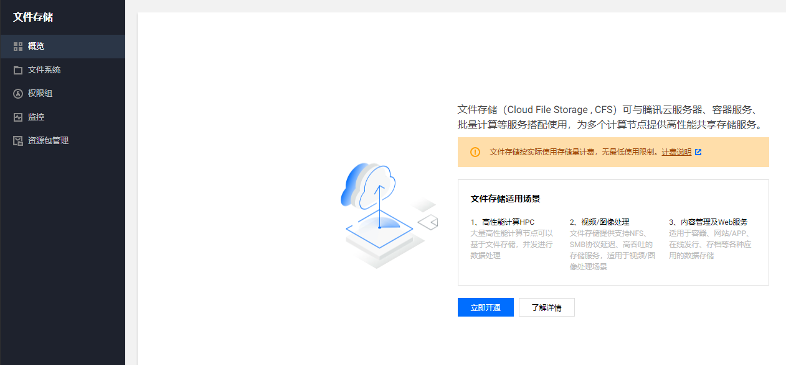
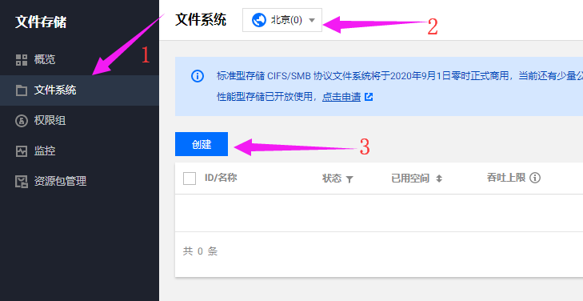
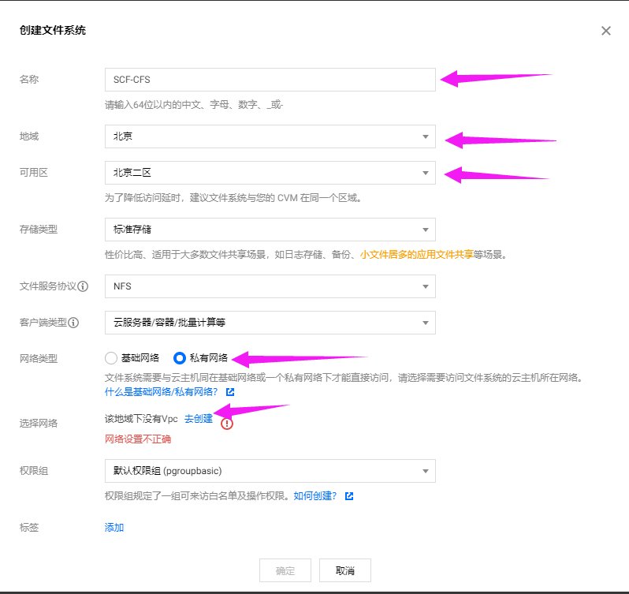
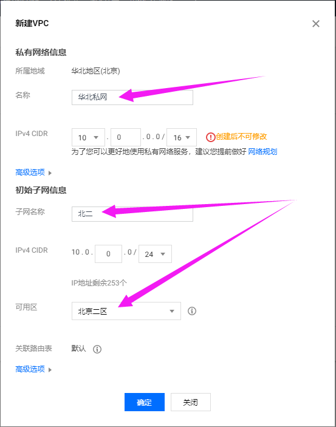
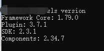
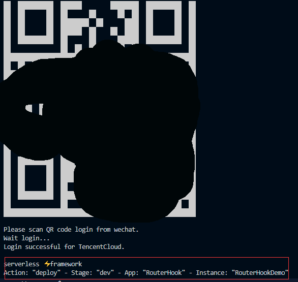
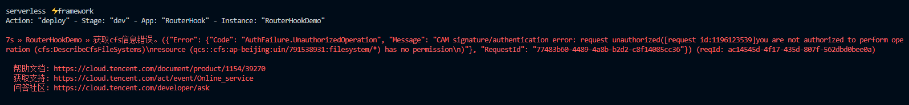
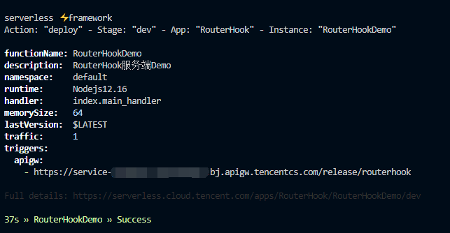
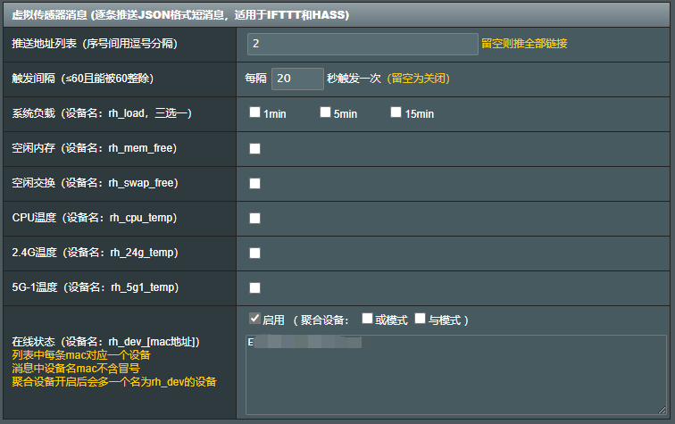

# RouterHook后端服务示例

本示例基于腾讯云Serverless平台搭建，只需注册并开通腾讯云Serverless平台即可，无需购买任何服务器等。同时由于Serverless的一定免费额度（100万次/月），所以可以说是白嫖一个小服务器。但是如果涉及到对外发送消息等，可能会出现少量的流量费或者API网关的使用费（后付费），具体我没有进行测试和计算，但预估不会很高（可能就一个月几块钱）。

比如如果拿来当作HASS场景使用，假设每30S调用一次，则一天调用次数为：60/30*60*24*31=89280次；若10S调用一次，则为267840次；若3S调用一次，则为892800次；都在免费额度以内。3s调用一次就已经很精准了，再短的话给路由的压力就太大了。没有必要。实际上10s或者30s一次就可以满足日常需求。

由于Serverless是无状态的，所以当处理诸如HASS这类状态消息的时候，往往需要记录之前的状态值，用来判断当前设备状态是否已经改变，所以我们就需要额外的组件来进行状态的存储。示例中我们选择了CFS文件存储，若你已经有自建的数据库或其他存储，也可使用自己的存储方式。（Serverless Framework创建的NoSQL数据库也有一定的免费额度）。使用CFS的原因是因为这样的学习成本最低，就相当于一个本地文件的读写操作，对于刚入门的小白来说最为合适。毕竟学习数据库、COS的使用都还是有一丁丁点儿门槛的，如果有兴趣的话可以自行了解。

## 准备步骤

### 一、注册并认证腾讯云
这里就不过多描述了，都很EASY，提供一个[【传送门】](https://cloud.tencent.com)

### 二、开通CFS文件存储

登录CFS[【控制台】](https://console.cloud.tencent.com/cfs/overview)，点击立即开通：

开通后，按照如下步骤操作：（地域务必和SCF的地域相同，比如我都是北京，你也可以都是广州，但一定要相同）

点击创建后弹出的页面如下图，需要额外注意以下几点：
1. 名称自己定义，建议参考图片
1. 地域同上面说的，一定要和你Serverless的地域相同
1. 可用区选择一个可用的就行（除非你知道CVM等其他用途，否则无所谓）
1. 文件协议选择NFS，因为SCF云函数的底层环境是CentOS
1. 网络类型选择私有网络！（必须选择私有网络哦！否则SCF无法挂载）

点击去创建后跳转到私有网络页面，如果对网络不了解，那请直接按图配置即可，注意事项如下：
1. 私有网络分为私网和子网，子网是私网下属的网络
1. 私网的名称尽量和地域相同即可，比如如图所示的华北地区，就写`华北私网`
1. 子网名称和可用区对应比较好，比如我们看到CFS只有`北京二区`等几个区可用，则我们就建一个同该可用去相同的子网即可，所以图上子网的可用区选择了`北京二区`，并起名`北二`

私有网络创建完后，请在控制台【子网】页面中，将刚刚创建的网络的ID对应填写到`.env`中，包括私网ID（所属网络ID）填写到`VPCID`，子网ID填写到`SUBNETID`中

然后我们返回到CFS的创建页面，重新新建一个CFS（刚才没有私网），这时候看到私有网络这里可以刷新出来刚才所创建的私网了，选中后创建即可。

创建成功后，请记下这个存储实例的ID，然后稍后填入本项目下的`.env`的`CFSID`中

### 三、开始部署SCF

首先请你的电脑上安装`NodeJS`，这里推荐版本是[NodeJS12.X](https://nodejs.org/dist/latest-v12.x/)，下载并进行安装即可。

安装完成后，请安装`Serverless Framwork CLI套件`，方法也很简单，CMD命令窗口运行`npm i serverless -g`等待安装结束。如果安装比较慢，可以通过如下方式加速：
1. 首先全局安装cnpm:`npm i cnpm -g`
1. 然后所有的npm命令都替换为cnpm即可，比如：`cnpm i serverless -g`即可。

安装完成后，控制台输入`sls version`，如果输出如下界面说明安装成功：

1. 首先请确认按照上面的说明已经配置好了根目录下的`.env`文件
1. 在项目根目录下运行命令：`cnpm i`来安装依赖包
1. 在项目根目录下运行命令：`sls deploy`进行自动化部署
1. 如果一切正常，命令行界面会弹出一个二维码，请通过微信扫码并在手机上登录你注册的腾讯云账号，同时进行授权
1. 授权成功后，系统就会自动进行部署啦！
1. 如果需要移除，请直接在项目根目录下运行命令：`sls remove`即可。

初次部署的时候可能会遭到如下报错：

这是由于腾讯云当时还没有授权账户获取CFS的列表权限导致的（已经和官方童鞋反馈，后期可能会修复），当下的解决办法如下：

1. 登录腾讯云控制台的访问管理，角色管理页面：[【传送门】](https://console.cloud.tencent.com/cam/role)
1. 找到角色名称为`SCF_QcsRole`的这个角色，点进去，点击关联策略
1. 在策略列表左侧搜索`CFS`，然后选中`QcloudCFSFullAccess`权限到右侧，点击确定
1. 之后再运行deploy即可

部署成功后，可以在控制台看到类似如下内容：

可以看到，那个apigw下面的访问地址就是当前服务的远端地址。在RouterHook中填入此地址即可触发云函数的运行。

### 四、配置你的通知逻辑

转到项目根目录下的`index.js`中，阅读代码并了解原理，代码中已经提供了一个bark的`GET`示例和一个企业微信的`POST`示例。具体你可以修改为你自己需要的推送平台（钉钉等）
网络请求发送模块采用的是`Axios`，你可以直接到网上查看它的使用说明。
同时也可以采用`Postman`进行接口测试后自动生成`Axios`的代码，也是很方便小白的方式。

### 五、配置路由器RouterHook插件

1. 首先在Hook URL中填入上面我们得到的Hook地址
1. 在Header中添加`basicAuth`，内容要和本代码中`index.js`的对应，默认为`woshiyigexiaokeai`
1. 在RouterHook下方的`虚拟传感器消息`中进行自定义配置，这里我们配置一个`在线状态`功能：
    1. 首先填入某个设备的MAC地址
    1. 选择启用
    1. 触发间隔选择5S或更长（不建议第一次选择间隔太短，影响调试）
    1. 推送地址列表根据你的需要填写或置空
    1. 提交保存
1. 回到腾讯云SCF的Web控制台页面：[传送门](https://console.cloud.tencent.com/scf/list)
1. 找到我们刚才部署的那个云函数`RouterHookDemo`
1. 可以在日志查询中查看具体的调用日志情况，如果出现报错（正常情况下应该不会），请在群里求助

